# Procedural Shading Notes

# Colors

### values are nodes in grey

### Colors are nodes in yellow

### Vectors are nodes in Purple

### Shaders are nodes in Green

---

## _Values are_

0 = Black

1 = White

- The color can go below to below 1 but and above 1
- When the color is converted to a value, the three color channels have to be reduced to 1
- The calculated value is the **luminosity Value**
- The Luminosity is a method to the percieved brightness nad is caluclated as a whited avarage of RGB
- If you have to choose a color for a value, choose the same value for all RGB channels
- Use **COMBINE RGB NODE**

---

**Set color management Look to NONE**

**Set filmic to none to have a better understanding just for a little**

---

## _Vectors are_

**containers of multiples separate values**

- it has 3 dimensions (x,y,z)
- it always interpreted as a _position_ or _Direction_
- use **Combine XYZ NODE**
- The values are not clamped from 0 and 1
- NO CONVERSION IS NEEDED
  
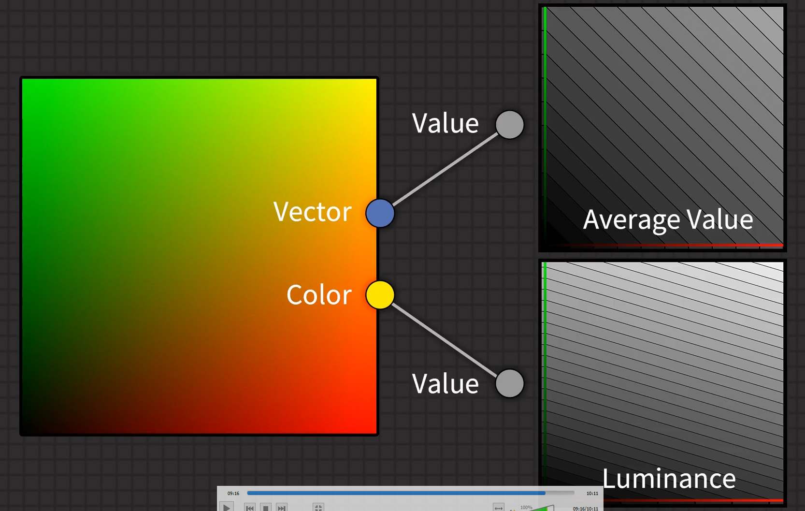

---

# Image Textures Node

Static Image Textures are made of Pixels
They have to plugged into an **UV MAP** to have some coordinates

* **UV MAPS goes from 0 to 1 for X and Y values**
* **Red Part goes 0 to 1 to X axis**
* **Green Part goes form 0 to 1 in Y axis**
* Coordinate maps are a continous gradient without steps
* Image texture node take coordinates --> decides withc pixel belongs to that position --> and displys the according color
* Linear softs the pixelation
* Closest increases the pixelation
---
# Procedural Textures Nodes
* Image textures can be created procedurally
* They are matemathical functions
* They are calculated on the spot
* They are done with nodegraphs
* The pixelation depends on the techniques used to create it
* Procedural textures can have any level of detail

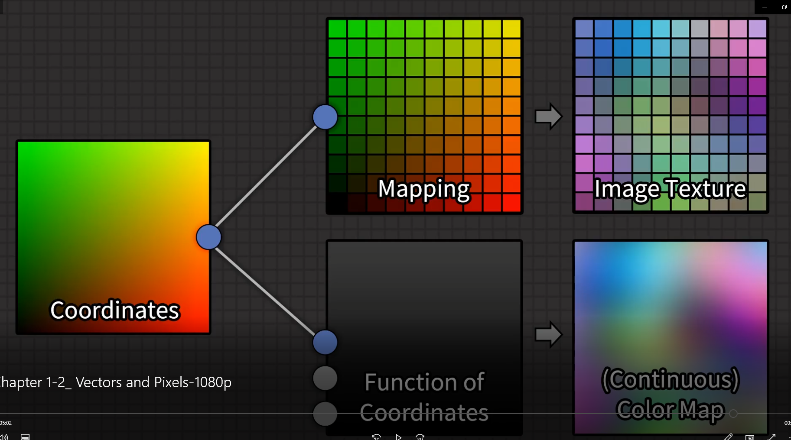

---

# Coordinates Types

## Texture Coordinate node

# Generate Coordinates
 * Generate coordinates are anchored to the local bounding box of the object
 * Range from 0 to 1 along each of the 3 axis
 *  **They move with the orientation and location of the object, that means that they scale with the object**
 *  Used when I want that a texture have to appear on the object bounds
  
  # Normal Coordinate node

* Are non coordinates in sense of location
* **Are coordinates in the sense of direction**
* **A normal vector is = to the direction perpendicular to the surface nad has a LENGHT of 1**
    * They use _LOCAL SPACE_, so they are anchored to the object transformation
    * You can get **GLOBAL NORMALS** from the _GEOMETRY INPUT NODE_ Can be found in the **GEOMETRY NODE**
    * They are used to incorporate the object geometruy into a shader
  
  # UV Coordinates
* Are the most conventional way to apply textures
* They stick to the object Geometry, **they are not susceptible to mesh movements**
* UV UNWRAP IS NEEDED, _no shit_
* (Uv unwrap  = transform a 3d object in a 2D space)
* The major benefit is that you can decide the direction and flow of the texture without caring abaut the warping around the mesh

# Object coordinates
* They are centered around the object origin
* They are connected to the object location, rotation and scale
* Is the most common go to for procedural shading
* Used when mesh properties are not needed
* **Mind that object coordinate origins and scale matter**
* Many times is better outsourcing the object coordinates via an empty object, usefl to not change the object main coordinates at all
* As a general guideline, use them with objects that have to scale and stretch
 
 # Camera coordinates
 * Oriented with the the camera view
 * Oriented withe the orientetion of the viewport
 * Commonly used with a **DEPTH PASS** within the shader
 * used for "fake" effects as myst and thngs that have to be stack to the view

# Window Coordinates
* Are two dimensionaal along the X and Y of the Viewport
* They range from 0 to 1
* They scale along with the window
* When in camera view, they are locked to the bounds of the camera
* Commonly used to create Radieal gradients in the world shader
* Works great as a background

# Reflection Coordinates
* Like normals are **NOT coordinates in the sense of location**
* They are coordinate in the sense that **they give informations of the direction of a ray that would be reflected on the surface coming from the viewr**
* Used to generate fake reflections from a specified angle
  
# Position Coordinates
 Can be found in the **GEOMETRY NODE**
* They are anchored to the world (global coordinates)
* Used to create textures that are consistent for multiple objects
* Used to create global effects (dust)

# Geometry node In breaf
(Blender Manual)

(Not highligted = never Used)

Position

Position of the shading point.

Normal

Shading normal at the surface (includes smooth normals and bump mapping).

Tangent

Tangent at the surface.

True Normal

Geometry or flat normal of the surface.

Incoming

Vector pointing towards the point the shading point is being viewed from.

Parametric

Parametric coordinates of the shading point on the surface. To area lights it outputs its UV coordinates in planar mapping and in spherical coordinates to point lights.

Backfacing

1.0 if the face is being viewed from the back side, 0.0 for the front side.

**Pointiness** Cycles Only

**Useful to get EDGE WEAR masks**

An approximation of the curvature of the mesh per vertex. L**ighter values indicate convex angles, darker values indicate concave angles.** It allows you to do effects like dirt maps and wear-off effects.

**Random per Island** Cycles Only

A random value for each connected component (island) of the mesh. It is useful to add variations to meshes composed of separated units like tree leaves, wood planks, or curves of multiple splines.

---

# Procedural Textures included in Blender

## Noise Textures
* based on a Perlin Noise
* Organic pattern that look random
* Distorsion warps the texture
* Rouhghness will function only if there is a high level of detail
* **Used for give "randomness" to apattern**

## Voronoi
* Partition a surface into random cells and groups the space by the closest points 
* F1 looks more organic
* Distance to Edge allows to isolate the edges
* **Used to make granural surfaces**
  
## Musgrave
* Based on Perlin Noise but with more parameters
* **Used to make Enviroments and terrains**

## White Noise
* Returns a different random value for every possiblle input
* Totally random map
* **Used to give a random value to a Seed**

---

# Shape Control (important)

## Free Form Shapes

* Manipulate shapes is all about manipulate gradients that are between the values 0 and 1
* **First of all you have to _Separate XYZ_**
* **Greater Than is used to create straight lines**
* 
* **To change the angle _Subtract Y to X_**
* 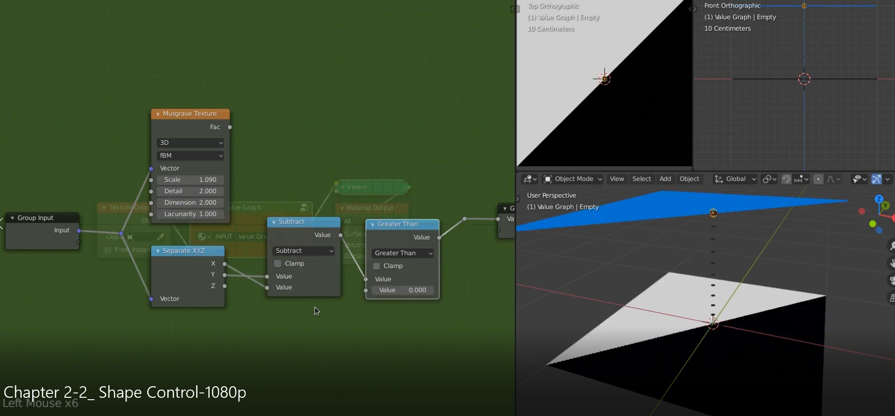
* **To manipulate the obtained straight edge, add _Math Node_**
* 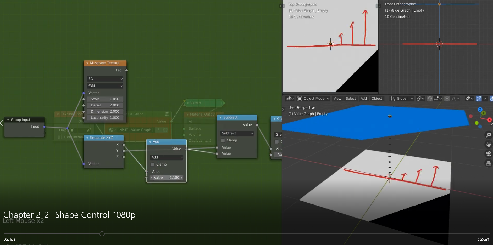
* **Add an _RGB Curve_ to change the straight line into a shape**
* 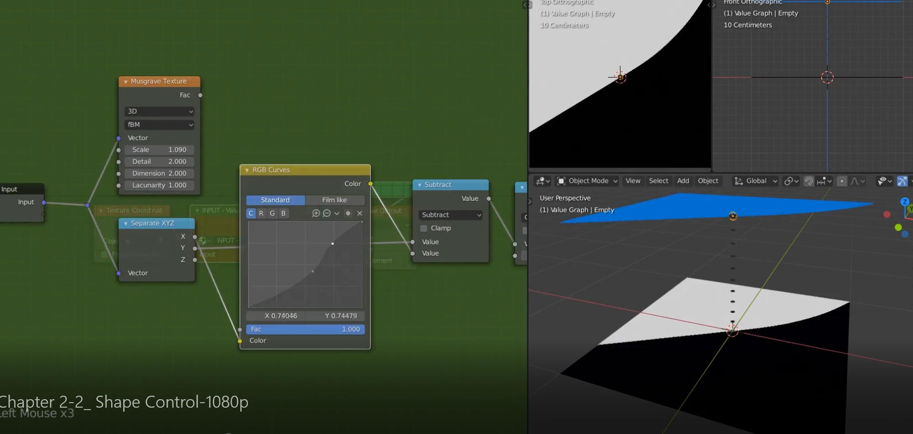
* **Since the RGB NODE goes only from 0 to 1, the changes are limited, the best way to have more freedom is to add a _Multiply Add_ with both inputs 0.5 on the Y and a _Map Range_ with values of -1 to to the RGB Color**
* 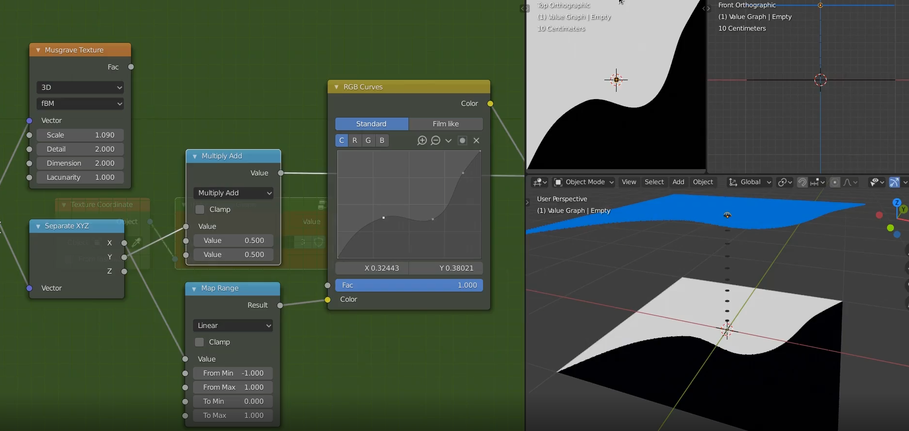
* If switch the Multiply add with Absolute the shape will be mirrored
* 
---
## Circular Shapes
*  In order to create circular shapes is using _Polar Coordinates_
*  Normal coordinates gives informations on one point to the axis es: x=1 , y=1
*  _Polar Coordinates_ instead are based from the distance to the origin and the angle of the direction
*  To get these coordinates: _Separate XYZ_ and use _Math Architant 2_ than Remap from 0 to 1 Using the _Map Range Node_ typing in _-pie and pie_ in From Min From Max.
*  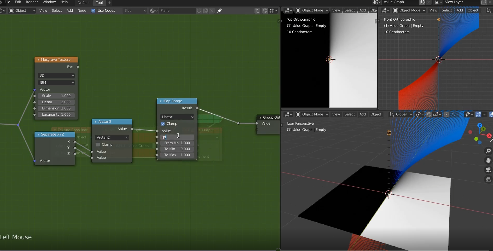
*  The radious is simply the lenght of the coordinate vector that can be simply get with _Vector Math_ Node with LENGHT
*  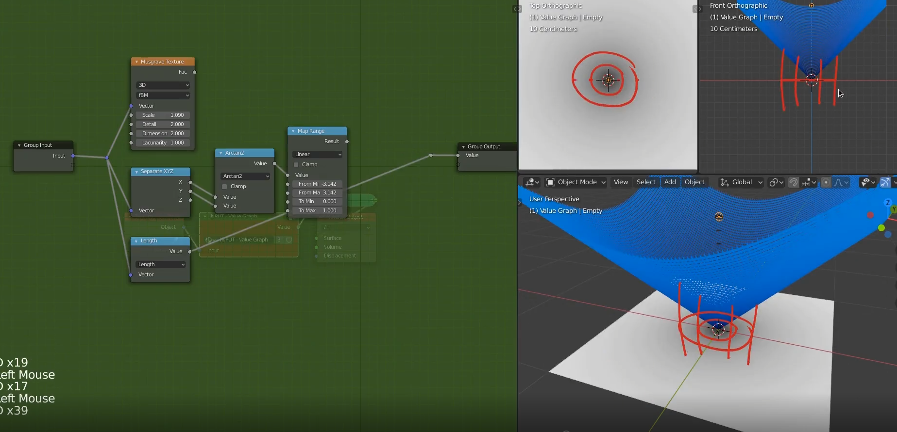
*  Since the radious have to be indipendent from the Z axis, we need to isolate the Z with _Combine XYZ_ Node and connect from _Separate XYZ Node_ X and Y coordinates into _Combine XYZ_ Node
*  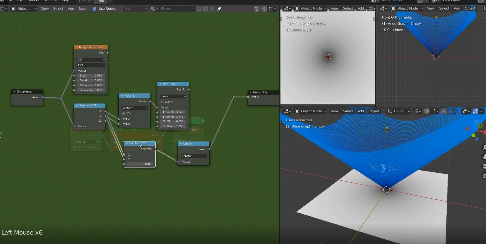
*  Now We are oprating only on a plane
*  Manipulare the angle with _RGB Curve_ Node and _Subtrat Node_ from the radious
*  
*  If you want the shape to be closed you have to be sure that the starting point of the rgb curve is the same of the ending point
*  To mirror and ceate a free form shape we need to: 
   *  _Map Range_ From Min = 0 , Result to Outpoint
   *  _Arcatan 2_ to _Absolute_, Value to outpoint
   *  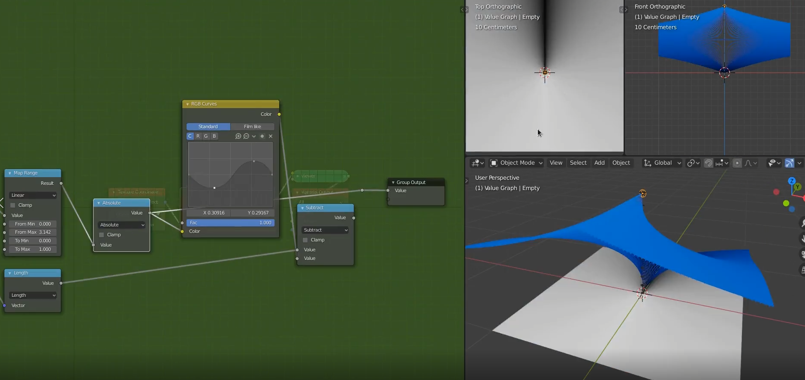

---

## Edge Fall-off

* In order to have a soft edge, delete the _Greather Than_ Node and replace it with a _Subtraction_ Node
* 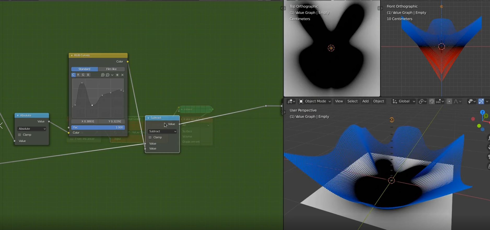
* To have a smoother Edge, you can _Multiply_ the value
* 

---

# Repetition

